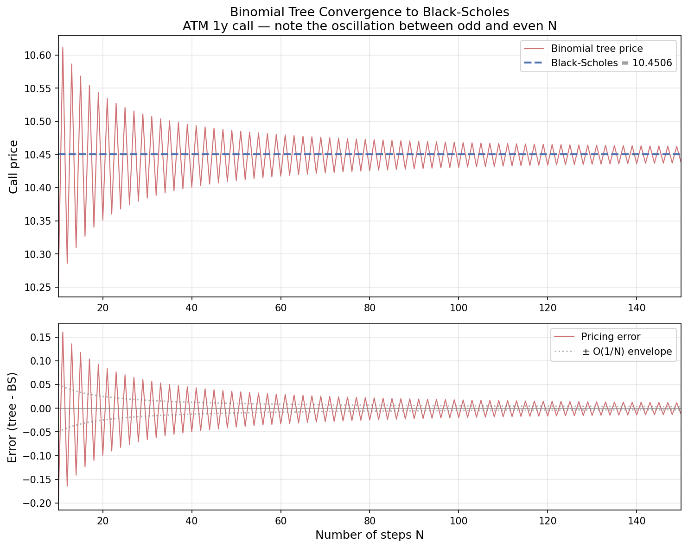
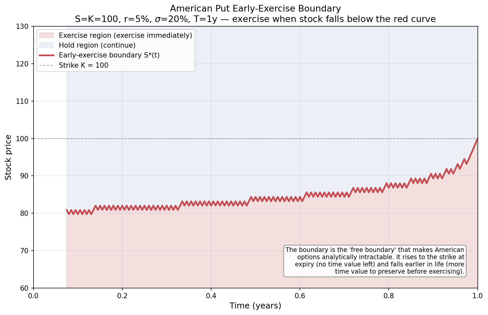

# American Option Pricing: Binomial Trees & Longstaff-Schwartz Monte Carlo

Two complementary numerical methods for pricing American options, where Black-Scholes has no closed-form solution. Implements a Cox-Ross-Rubinstein binomial tree and Longstaff-Schwartz least-squares Monte Carlo, validates them against each other, extracts the early-exercise boundary, computes finite-difference Greeks, and extends to multi-asset basket options to demonstrate the curse of dimensionality.

Fifth project in a quantitative finance portfolio. Strengthens the derivatives-pricing track alongside the Black-Scholes and Monte Carlo pricers.

## Highlights

- **CRR binomial tree** for European and American options, converging to Black-Scholes at the theoretical O(1/N) rate with the characteristic odd/even oscillation
- **Longstaff-Schwartz LSM** — the regression-based Monte Carlo method that prices American options by simulation, validated against the tree on the American put
- **Early-exercise premium** quantified: ~$0.52 for an ATM put (a number with no closed-form formula), zero for non-dividend calls (confirming the no-early-exercise theorem)
- **Multi-asset basket option** priced with Cholesky-correlated LSM, demonstrating why lattice methods fail beyond ~3 dimensions (a 5-asset tree needs 10^15 nodes)
- **Early-exercise boundary** extracted from the tree and plotted — the "free boundary" that makes American options analytically intractable
- **American Greeks** via finite differences, showing American put delta hits -1 in the exercise region (behaving like short stock)
- **18 passing tests** across convergence, parity, early-exercise, tree/LSM agreement, Greek signs, and basket diversification

---

## Convergence to Black-Scholes



The binomial tree price oscillates around the Black-Scholes value, with the error damping as O(1/N). The oscillation between odd and even N is a well-known CRR property — averaging adjacent N values, or switching to Leisen-Reimer trees, removes it and yields O(1/N²) convergence.

## Early-Exercise Boundary



The American put's early-exercise boundary S*(t): exercise immediately when the stock falls into the red region. The boundary rises to the strike at expiry (no time value left to preserve) and falls earlier in the option's life (you need the put deeper in-the-money to justify giving up the remaining time value). This is the free boundary that makes American options analytically intractable.

---

## Project structure

```
tree-pricer/
├── binomial_tree.py        # Day 1: CRR tree for European options
├── american.py             # Day 2: American options + early-exercise premium
├── longstaff_schwartz.py   # Day 3: LSM Monte Carlo, validated against the tree
├── basket_option.py        # Day 4a: multi-asset basket via correlated LSM
├── greeks_boundary.py      # Day 4b: exercise boundary + finite-difference Greeks
├── plot_tree.py            # Day 5: visualizations
├── test_tree.py            # 18 passing tests
├── requirements.txt
└── README.md
```

## Methodology and findings

### Step 1: The binomial tree (European)

The Cox-Ross-Rubinstein tree models the stock as moving up by `u = e^(σ√Δt)` or down by `d = 1/u` each step, with risk-neutral probability `p = (e^(rΔt) - d)/(u - d)`. Pricing is backward induction: terminal payoffs discounted back through the lattice.

Validation against Black-Scholes (ATM 1y call, S=K=100, r=5%, σ=20%):

| N | Call price | BS error |
|---|---|---|
| 50 | 10.4357 | -0.0149 |
| 250 | 10.4426 | -0.0080 |
| 1000 | 10.4486 | -0.0020 |
| 2000 | 10.4496 | -0.0010 |

The error halves as N doubles — clean O(1/N) convergence. Put-call parity (`C - P = S - Ke^(-rT) = 4.8771`) holds exactly at every N.

### Step 2: American options and the early-exercise premium

Extending to American options requires one change: at each node, take `max(continuation, immediate exercise)`. Results (N=1000):

| Option | American | European | Early-exercise premium |
|---|---|---|---|
| Call | 10.4486 | 10.4486 | 0.0000 |
| Put | 6.0896 | 5.5715 | 0.5181 |

The **call premium is exactly zero**, confirming the classic result that non-dividend calls are never exercised early. The **put premium is positive** — a quantity with no closed-form formula. Deep in-the-money puts (S=70) pin exactly to their intrinsic value K-S=30, while the European put at the same spot is worth only 25.56 — less than its own intrinsic value, because the European holder cannot exercise to capture the time value of money.

### Step 3: Longstaff-Schwartz Monte Carlo

LSM prices American options by simulation, using regression on in-the-money paths to estimate the continuation value at each exercise date. Validated against the tree:

| Paths | LSM price | vs tree (6.09) |
|---|---|---|
| 10,000 | 6.1203 | +0.030 |
| 100,000 | 6.0247 | -0.065 |
| 200,000 | 6.0588 | -0.031 |

LSM converges to the tree value (6.09), **not** the European value (5.57) — confirming it correctly captures the early-exercise premium. Since the American put has no closed-form price, the agreement between a lattice method and a regression-based simulation is the only available validation. The LSM estimates scatter within a few cents of the tree; the theoretical low-bias (from the suboptimal estimated exercise policy) is small enough to be masked by Monte Carlo sampling noise at these path counts.

### Step 4a: Multi-asset basket options

A 3-asset American basket put, priced with Cholesky-correlated LSM: **$5.4725**. Lower than a single-asset put because basket diversification reduces effective volatility from 25% (weighted-average) to 18.45% — a 26% reduction.

The dimensionality argument for why the tree cannot price this:

| Assets | Tree nodes at N=1000 |
|---|---|
| 1 | ~10^3 |
| 2 | ~10^6 |
| 3 | ~10^9 |
| 5 | ~10^15 |

A 5-asset basket would need 10^15 tree nodes — physically impossible. LSM scales linearly in dimension, pricing the basket in seconds. **This is the entire reason Longstaff-Schwartz exists.**

### Step 4b: Exercise boundary and Greeks

The early-exercise boundary, extracted from the tree, runs from S*≈79.75 early in the option's life up to the strike (100) at expiry. American put Greeks (finite differences):

| Greek | Value |
|---|---|
| Delta | -0.4111 |
| Gamma | 0.0259 |
| Vega | 0.3753 (per 1% vol) |
| Theta | -0.0061 (per day) |
| Rho | -0.3020 (per 1% rate) |

The most striking result is the American-vs-European delta comparison. At S=80 (deep ITM), the **American put delta is exactly -1.0000** — the option is in its exercise region and behaves like short stock — while the European put delta is -0.7775. The early-exercise feature makes the hedge ratio jump to -1 across the exercise boundary.

---

## What I learned

**The early-exercise premium is real and has no formula.** The ATM American put is worth $0.52 more than its European twin, and that number cannot be computed analytically — it requires a numerical method. Watching the binomial tree and LSM independently agree on it (with no closed form to check against) is the most satisfying validation in my portfolio: two completely different numerical methods converging on a number neither can verify against ground truth.

**The call/put asymmetry comes entirely from the time value of money.** Non-dividend calls are never exercised early (exercising means paying the strike early and forgoing interest), so American = European. Puts can be exercised early (exercising means receiving cash early and earning interest), so they carry a premium. The whole asymmetry reduces to whether you're paying or receiving the strike.

**Lattice methods die in high dimensions; Monte Carlo doesn't.** A binomial tree is simpler and more accurate than LSM for one underlying — but a 3-asset basket needs a billion-node tree and a 5-asset basket needs 10^15. This is why LSM is the industry standard for multi-asset American and Bermudan products. Building both methods, then showing one solves a problem the other fundamentally cannot, was the intellectual arc of the project.

**The exercise boundary is the free boundary.** American options are hard precisely because the optimal exercise threshold is part of what you're solving for. Extracting it numerically from the tree and seeing it curve from the strike (at expiry) down to ~80 (early in life) made the abstract "free boundary" concept concrete.

**American delta hits -1 in the exercise region.** Once a put crosses its exercise boundary, it's optimal to exercise, and the option behaves exactly like a short stock position — delta of -1. This has a direct hedging consequence: a delta-hedger would need to be fully short one share per option once the stock crosses the boundary.

---

## Running it

```bash
pip install -r requirements.txt

python3 binomial_tree.py        # European tree, convergence to BS
python3 american.py             # American options, early-exercise premium
python3 longstaff_schwartz.py   # LSM, validated against the tree
python3 basket_option.py        # multi-asset basket + dimensionality argument
python3 greeks_boundary.py      # exercise boundary + Greeks
python3 plot_tree.py            # generate the plots

pytest -v                       # 18 tests
```

---

## Tests

18 tests across seven categories: European convergence to Black-Scholes, exact put-call parity, the American≥European relationship and the early-exercise premium, tree/LSM agreement, Greek signs, exercise-boundary shape, and basket diversification.

---

## Limitations and future work

1. **No dividends.** Discrete or continuous dividends would make American call early-exercise relevant and are a natural extension.
2. **CRR calibration only.** Leisen-Reimer trees converge at O(1/N²) without oscillation; worth implementing for higher accuracy at lower N.
3. **Basket LSM regresses on basket value only.** A more accurate basket pricer would regress on basis functions of all individual asset prices, not just their weighted sum — using only the basket value introduces a small additional bias.
4. **LSM low-bias not isolated.** The theoretical suboptimal-policy low-bias is masked by Monte Carlo noise at these path counts; averaging over many seeds would isolate it. A Glasserman-style two-pass estimator would remove the in-sample look-ahead component.
5. **No American-specific variance reduction.** Antithetic variates or control variates (using the European price as a control) would tighten the LSM estimates.
6. **Greeks via finite differences only.** Pathwise or likelihood-ratio Greek estimators would be more efficient for the Monte Carlo pricer.

---

## References

- Cox, J., Ross, S., Rubinstein, M. (1979). "Option Pricing: A Simplified Approach," *Journal of Financial Economics*, 7.
- Longstaff, F., Schwartz, E. (2001). "Valuing American Options by Simulation: A Simple Least-Squares Approach," *Review of Financial Studies*, 14.
- Hull, J. *Options, Futures, and Other Derivatives* — binomial trees, American options, Greeks.
- Glasserman, P. (2004). *Monte Carlo Methods in Financial Engineering* — LSM bias analysis and variance reduction.

---

Part of a broader quantitative finance project portfolio:
- Project 1: [Black-Scholes pricer with Greeks and IV solvers](https://github.com/Dev2943/bsm-pricer)
- Project 2: [Monte Carlo with variance reduction and exotic payoffs](https://github.com/Dev2943/mc-pricer)
- Project 3: [Multi-factor equity model with Fama-MacBeth and momentum backtest](https://github.com/Dev2943/factor-model)
- Project 4: [Portfolio VaR & ES with backtesting and stress testing](https://github.com/Dev2943/var-calculator)
- Project 5 (this): American option pricing with binomial trees and Longstaff-Schwartz Monte Carlo
